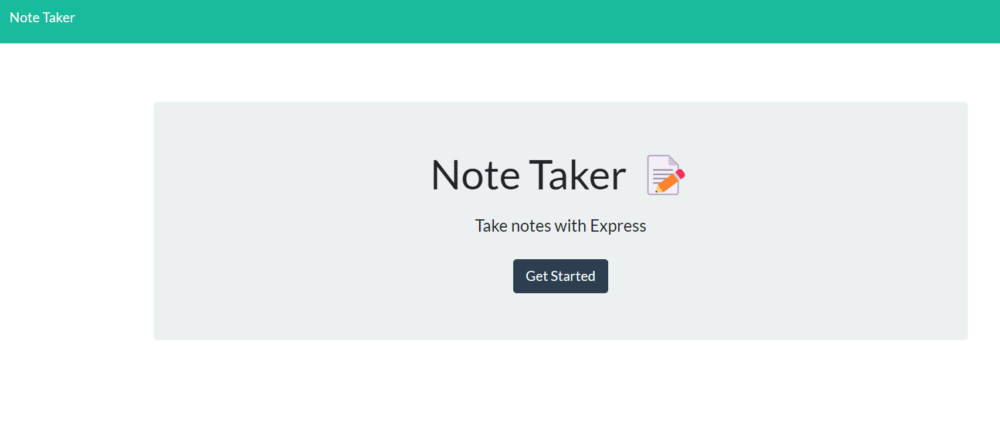
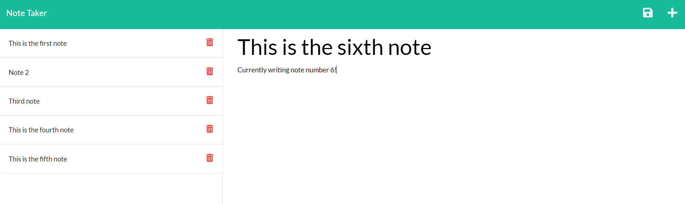

# Note-Taker

## <section id = "License">License</section>
N/A

## <section id = "Description">Description</section>
This project was made using express and node.js, which allows users to create and save notes. Once a user has given their note a title and has also finished writing the note text, a save button will appear. Clicking on it will store their note to the left side of the application for future reference and can click on their past note to see the content of it towards the rightside of the application. To add a note, users can click on the + sign in the top right corner. Clicking on the red trashcan allows for the deletion of specific notes.

Link to heroku application: https://v2-note-taker.herokuapp.com/

Link to github application: https://cgotts1.github.io/V2-Note-Taker/

## Table of Contents
1.) <a href = "#License">License</a> 
2.) <a href = "#Description">Description</a> 
3.) <a href = "#Installation">Installation</a>  
4.) <a href = "#Usage">Usage</a> 
5.) <a href = "#Contributing">Contributing</a> 
6.) <a href = "#Tests">Tests</a> 
7.) <a href = "#Questions">Questions</a>

## <section id = "Installation">Installation</section>
Command to Install Dependencies: npm i, npm i express

## <section id = "Usage">Usage</section>
Using the Repo: N/A 

## <section id = "Contributing">Contributing</section>
Contributing to the Repo: Currently not taking contributions.

## <section id = "Tests">Tests</section>
Command to Run Tests: N/A

## <section id = "Questions">Questions</section>
If you have any questions, please feel free to contact me:   
1.) Github Username: Cgotts1  
2.) Email Address: cobi.gottschalk@gmail.com
